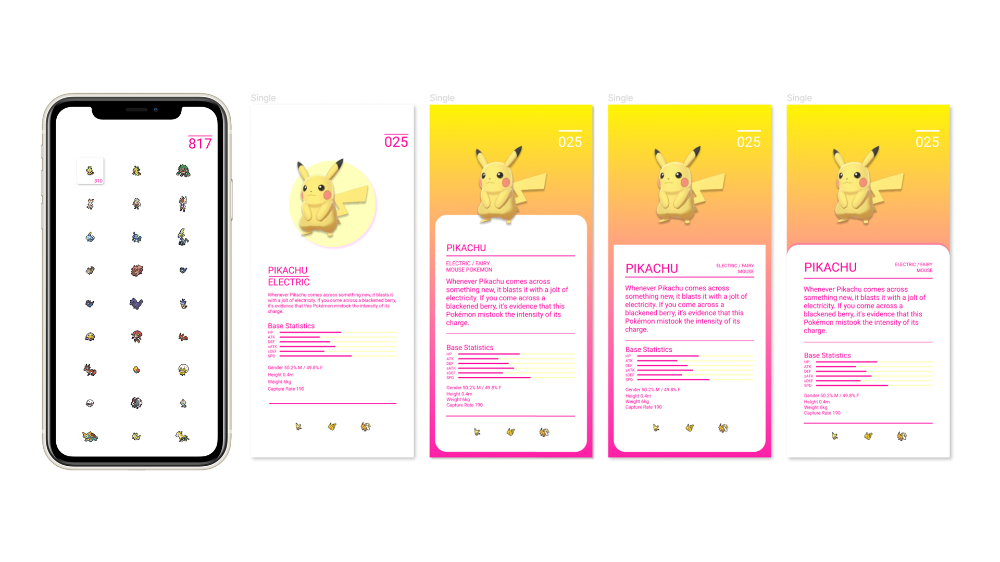

# pdex [work in progress]

A PokeDex app using Flutter and Firebase.

A self-directed project to get started learning Flutter and Dart, and how to connect and utilize Google's Firebase database to store and retrieve the required Pokemon information.

The UI design options (seen above) was worked out in Figma.
